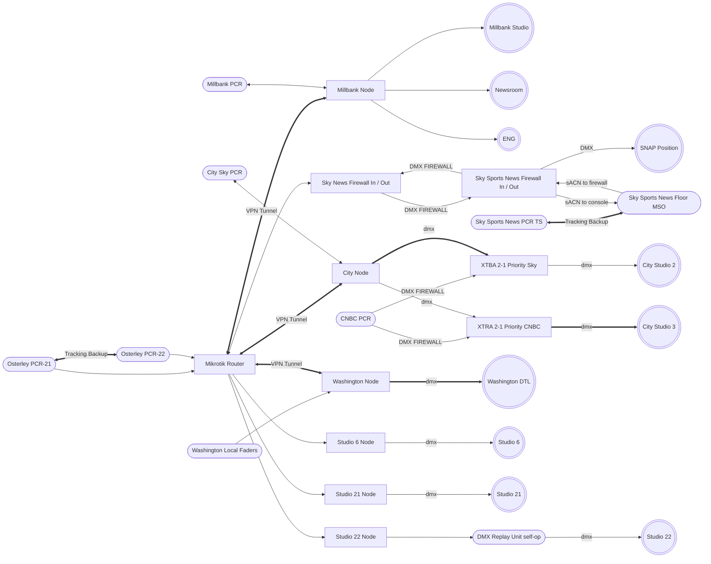

## Sky News

### Technology Innovation

Richard introduced **LED lighting** for initially for energy-efficiency and increased reliability/reduced maintenance reasons, but this also enable the introduction of **Remote Operations** into these spaces; something that simply wasn't practical with traditional tungsten luminaries for many reasons; most critically, fire safety.

From 2013, as a variety of studio and newsroom spaces were built / refurbished, he ensured that each was equipped with the best and most suitable LED luminaries available at those times, including:

- _ETC Source 4 Series 1 Studio initially then Series 2 Daylight_
- _Arri SkyPanel S30RP & S60RP. L-series L7-DT_
- _Litepanels Gemini 2x1 & 1x1, Astra 3X & 6X, Sola 4+_
- _Dedolight DL-9_

By 2018 all studios were fully LED-lit, except for Millbank (at about 50%), which became fully LED in 2020.

<hr>

### Project Tardis - Introduction

A whole series of changes for Sky News came under the umbrella of _Project Tardis_ and its follow-on the City Studios. This mammoth project was to move Sky News out of their own building (Unit 1) across the road to Sky Studios, and in the process introduce cost savings by automating the Production workflow. This was originally expected to take 6 months, but unsurprisingly, it took 18 months, and the overall number of production staff reduced was a tiny handful - for example, Director's Assistants and Vision Mixers went, but were replaced by "Co-Producers" and a lot of faith in the Space Bar. Despite original optimistic promises,Cameras and Sound ended-up much the same as before, but sadly the Lighting Technical Operators did disappear, as that role was taken on by the Technical Supervisors.

To fit Sky News into Sky Studios took substantial internal rebuilding efforts throughout to make enough space with a completely remodelled second floor, just  5 years after the building opened - everything from dressing rooms to edit suits had to be moved-about  _(something that became a recurring theme over the next few years, as ever-more technical things were squeezed to fit into a building that was compressed from its original intentions during Construction.)_ Hence the "Tardis" name - nothing to do with a rival broadcaster, everything to do with making lots of big things fit into a impossibly small space _although with less space-time distortion...well, apart from the dark mysterious bit at the back of the 4th floor with the mysterious technical equipment and mysterious people... oh wait, that's Engineering Support_.

Anyway, getting all the various aspects of this built and on-air tied-up Richard for a minimum of 2 days a week for 18 months, working on partial attachment to the loverly Projects Department. Whilst the lighting side he developed solo, he also was part of the technical evaluation teams for various related aspects, gaining valuable experience in not just the formal bid processes for multi-million pound contracts, but the disconnect between promises and deliverables.

<hr>

#### Project Tardis - Studio 21 (2016) "The Glass Box" Flagship

This is, quite literally, a Glass Box that was originally intended by the architects of the huge Sky Central office building _(basically the size of a 33-story tower block lying on its side)_ as a general-purpose studio space on prominent view whilst in use to all visitors and staff in the building, located directly in middle of the building half way between the main entrances, instead of hidden-away and impenetrable like most studios. This was an important move to make for a company that, which whilst its roots were in broadcasting, was rapidly transforming into a huge Telecommunications & IT orgnisation - at that point, broadcasting was approx. 700 out of 30,000+ people (both figures have since then be reduced considerably).

However, during Construction, the various broadcasting areas (Sports, Entertainments, etc.) were consulted, and only Sky News expressed an interest in actually using this studio on a regular basis within office hours. This meant that, instead of the space being a manned, multi-purpose, area with (somehow...) lots of set / camera / lighting changes, it was possible to build a static studio set with minimal on-site staffing and fixed technical infrastructure.

This was a concept that Sky News had started moving-towards with their Millbank Studio in 2010-11, which was then taken one step further by having just a Floor Manager (assisted by Make-Up and a Runner at busy times) and everything else being controlled from another building 10 minutes walk away.  


At Millbank, as originally built, between 2x and 4x technical staff covered the studio with the rest of the production process usually being done remotely - although a full-size gallery was built (partially as Disaster Recovery should the main site go catastrophically offline) this was never fully commissioned or utilised.

The core team was a Technical Director - doing everything Technical from routing video feeds to the lighting - paired with all the studio floor work being done by the Floor Manager (mostly ushering guests in and out, including acting as Sound Assistant, i.e. putting microphones on). Yes, the clue was there all along in the job titles...

 The cameras could be repositioned by these two into pre-marked positions, and then remotely-operated pan/tilt heads allowed for pre-set shots to be quickly recalled by the TD at quieter times. For busier productions, primarily around the evening politics show, and also for pre-recorded shows such as Entertainment Weekly, crewing numbers doubled with the addition of a Sound Supervisor and a Camera Operator - although still controlling the heads remotely. The gallery also made up the background of one of the main shots through a large viewing window (matching the then-main studio design) ...and any visiting Lighting Director would quickly discover that the seat they were in was empty for reason...the back of their head was now very prominently silhouetted on live TV around the world, just behind the presenter's ear...


For the glass box, as the Tardis project had begone, News dediced to takte this one step further, and have just a Floor Manager in the actual studios, and have all the technical control done remotely from the Gallery. Due to delays in Tardis, this remote control was temporarily re-routed to the old PCR (Production Control Room, or "Gallery") for the first year after the building amd studio opened.

That's the operation... but why the strange hanging cameras? This was the rest of the collision between the desire by News for a simple, static space with freedom to use the whole area, together with an edit from the then-CEO of Sky UK, Jeremy Durrock, that the view from the outside should be clear of ALL technical equipment, including the cameras! _Never mind what the viewers at home see, the viewers outside the studio are more important...He did have a point about the TV Production on-site being invisible to everyone else though..._ Ok, fair enough, we'll hang the cameras down on fixed bars in the corners, we can get them just about far enough away, and can have the lights as far back as possible with obstructing them.

And then...News insists that the cameras have to be respositionable live in-vision (as they had been expecting robotic peds as per their exisiting main Studio A.), Unlike floor cameras that can (reasonably), moving cameras handing down are going to get in the way. A full 6-axis movement wouldn't be possible without removing all the lights, so two neat arcs were drawn up, running up and down the studio front to back. Unfortuneatly, after these camera tracks were design and ordering, News had a wobbly moment and decide to spin all their positions round by 90-degrees. And now the cameras are tracking on the wrong axis. Doh! Anyway, back to lighting : Physics (or Optics) has now becomee a really big problem! Up to this stage, the SKy News Lighting Style was very traditional Hard Key / Fill / Kick / Backlight person. But either the cameras would in moving in front of these hard lights, or the angles would be horribly steep!

Jon Bennett decided to bring in Dave Evans LD, who had worldwide News Studio design experience, to come up with a solution to this dilemma. His solution was both elegant and effective, and also determined the lighting style desired by Sky News for the rest of the decade, due to its flexibilty about where people could go and be lit, and because of the minimal adjustments needed for different skin tones etc. This was a dense 360-degree ring of Arri S60 Softlights, all with very tight eggcrates to minimise spill onto walls or flares into camera - but also removing about 70% of their light output- togther with clusters of ETC S2 Source-4 LED profiles to give a sparkle in people's eyes - however these had to be a very low level, to avoid camera shadows (or as often happened, a camera parked right in front of a keylight because the eyeline to camera was spot on in that position...and it wasn't cameras who then go moaned at because the person with the perfect eyeling also looked flat and gloomy...



<hr>

#### Project Tardis - Studio 6 (2017) - Real and Virtual Reality spaces

TBA



<hr>

#### Project Tardis - Studio 22 - Self-Op & Shared use (2017)

TBA



<hr>

#### Project Tardis - New Control System with Remote Operations (2017-2023)

The first stage was relatively straightforward. Studio 6 was chosen as the new, much smaller, presentation space (along with the just-built Glass Box)been earmarked as suitable, where Soccer Saturday had been permanetally located since before the building even officially opened in 2011. Studio 6, what had previously been used by Sky Sports News for Soccer Saturday, was the first to move
On-screen transmissoThe existing Studio 6 The Glass Box was used to enable the transition to happen, and

- As part of this 18 month project, there were also two new Production Control Rooms to build, and a new control system required. As part of the push towards studio automation, it was decided at the highest level that lighting operators could be replace by automation and technology.

- To fill this brief, a unique and unprecedented control system had to be developed. This was done entirely by Richard, and once on-air this system ran 24/7 for 7 years as further studio spaces were developed.
- Live simultaneous control of 7 studios across 4 sites on 2 continents.
- - All consoles independant - resilliant to intermittent disconnections and latency.
- Remote or Local control, with clear intuiative indication at a glance of status of all studios.
- Two-way interfaces with other control systenms, safely and securely firewalled by DMX
- Harddware VPN used to encapusulate and route traffic across internal networks with no Corporate IT complications.
- largest ETC Eos Network in world (by geography)
- Conditional and Sequential controls whilst being entirely macro and magic-sheet driven
- Designed, Developed and entirely Programmed by RB

(to complete)

<hr>

### Tardis II - the Rise of the Tardis.

This wasn't really called Tardis II, but that's what the revised control system got called.

The success of the Millbank remote studios resulted in a push to do the same with other remote studios. A minor Down-The-Line setup in Washington, DC, USA, extended the reach of the lighting network across the Atlantic, making this probably the largest (by distance) lighting network in continous real-time use. Latency was surprisingly low, although the local control was used most of the time. And then there was the relocation of the City Studio out of the Gerkin.

This prompted a significant re-thinking of the control system - out went the original concept of the two gallery consoles each having effectively two users - which saved a huge amount of duplicated work, thankfully - along with the manual hand-over between the Osterley and Millbank TS, and in came a universal automatic system of sharing of control between Osterley and any Local consoles. This was done via an ingenious system of "DMX smoke signals" - basically, one sACN universe was dedicated to each studio, with one set of channels being patched + used by Osterley, and another set of channels by the "local" console, etc. Further channels would indicate Blackout and so forth. This was a completly automated sequence of triggers, and was even integrated the famous "Default Values" as taking control of the studio was implicit.
.which eliminated any human-error (or hunan simply not being anywhere near their console!) problems of the old system, as either end could force control to themselves, or even push it to the other end. Changes to these would automaticaly trigger submaster changes t001 being Osterley, expansion to includ both "Locking" controls, "Lock Overrides", and "Crash Change" were designed but in practive were found not to be needed and would just add unnecessary complexity for edge case scenarios such as a TS being suddenly taken ill mid-show.

This exchange of control extended downstairs to Sky Sports News, so that a section their studio used by Sky News could be controlled by either of them, without actually connecting their networks except via 2-way DMX "Firewall".

But that wasn't all. for the two studios at CNBC, control had to be given \***\*or taken\*\*** not just by a local SKy console (ETC Nomad PC with Touchscreen) but by CNBC, with their own entirely different lighting control system. In the middle of the night, and without relying on any human intervention such as repatching. sACN merging of different networks was way too risky, however, dropping down again to DMX, XTBA had the solution with their Smart Switch 2:1 - combining this with the Sky dual-source system meant each studio had triple control sources - and this worked flawlessly all the time the Tardis II system was operational.





*you may be tested on your understanding of this...pay close attention to the arrow heads...*🤣


#### City Studios - within CNBC's studios in The City of London

Located very unusually in the corner of CNBC's London Studio, and going On-Air just as they went Off-Air, this was a pair of two small studio spaces. This was triggered by the Sky News needing to move out of their existing studio space, and the then-recent takeover of Sky by Comcast looking to save money by reducing sites together with a hasty change of US News Network partnership (previously Fox, who were now no longer Friends...).

To keep in-line with the previous Tardis project's naming schemes being both logical, inconsistent, and confusing, these were called City 2 and City 3 (City 1 being reserved for CNBC's studio which they didn't call it, and City 3 was actually a sub-set of City 1)

#### City 2




#### City 3



<hr>

### Millbank Main - Multi-use space

- Millbank various relights including major Refurb 2020 (during Pandemic - had to install mostly single-handedly)



<hr>

## Sky Sports Racing

MUCH MORE TO COME

#### Richard testing reflectivity of different wall cladding materials for SSR on camera in Studio 6





<hr>

## Sky Sports News

- Overall Supervisory & Support 2018-2023

- Completely replaced the original and worn-out 1st generation LED Lights with new fixtures in 2018 in a rolling series of overnight changes performed in a narrow window (4-5 hours), repatching, reprogramming, and rebalancing the each new block of lights night after night - all without disrupting daily output.
  
- In 2020, during the height of Covid lockdown and with very little other than a single presenter talking to camera, who was easily moved to anther studio, and all the journalists, editors, and so on working remotely, it was possible to have the first significant rebuild of the main area of the newsroom/studio since it opened 9 year earlier. However, apart from a couple of new lightboxes, this wasn't about set changes, but putting in flown camera tracks (instead of the manually-operated jib) and replacing the floor robots with new units;..

Two ceiling-mounted camera tracks, similar to the ones used in the glass box, were installed to replace the work previously done by a Jib (although not as flexible of course). The lighting was repositioned to take this into account, and new presentation positions at the main desk were created.

Additional lights were added, giving a new outer 360-degree ring of Arri S60's with 8-cell Eggcrates, allow impromptu Presentation or Guests anywhere in the central area, shot from any direction, for the first time. As at the earlier Millbank refurbishment, Richard had to do the bulk of the work rigging and cabling all the equipment himself due to heavy restrictions on personnel movements between different areas.

Lighting control also shifted from a dedicated Multi-Skilled Operator to the Camera MSO, which was a necessity by this point as none of the remaining MSO team were lighting specialists. A touchscreen system was developed based on feedback from the MSO's, designed to give a rapid recall of a standard base with the ability to tweak as needed. Despite initial request for multiple fader wings, it was notable that these, along with the main Gio console, were generally depreciated in favour of the touch-screen controls.

MORE TO COME



<hr>

## Sky Studios Cafe

A Fixed installation of trussing and lights in a public space (in-house coffee shop), originally intended for use for just one hour a week and so very lightly provisioned; this rapidly ended-up being used by up to 3 different productions a day - until the novelty wore-off after a year...and the space was then then only used a handful of times again!

--> FIND PICTURES <--
<hr>

## Sky Poker

Conversion of old Studio C (previously the Channel 5 News Studio) into a fixed studio. Used for a few years before they moved up north. Was, at the time this opened, the only studio had that was still operating in SD (Standard Defintion). Years later, this studio became the lighting workshop.

Along with the scavenged-together antique cameras, equally antique lights were found for this, with a mixture of Strand SL Profiles, 1k Pups, Arturo softlights, and a well-used set of Pulsar chromabricks (which were last seen still chugging-away in the SSR set, not bad for 20 year old LED's...)




<hr>

## The General-Purpose Studios (Sports, Entertainment, etc)

- When Richard first arrived, he found there was a multitude of different and incompatible lighting control systems in use, with the majority of presentation being done with manual faders. Each studio had its own unique technical infrastructure and challenges, and although there were some moving lights and early led effects units, these were little understood by most of the team.

Within just a couple of years, continuing the work of his predecesor Don Hart, he succeeded in drastically simplifing and unifing the control consoles into a single family (ETC Eos - eventually purchasing over 30 assorted models all the way from Nomad to Apex), and enhanced this by standardising the show file structure across site. The infrastructure migrated towards a standard methodolgy as much as possible, aand all new builds followed the same structure.

Over time, all the lighting electricians were successfully encouraged to embrace the benefits of consistent, quick, and repeatable cue-based operation, and the general standards of lighting faces improved - something critical as the studio cameras used during this timee quickly moved from SD to HD, side-tracked briefly into 3D, and then increased in resolution and colour-space to UHD. During this 10 years of rapid technology change, many of the lights in used were 20 years old at the start, and 30 years old at the end - and still pefectly suitable when used appropriately,

```

```

```

```
