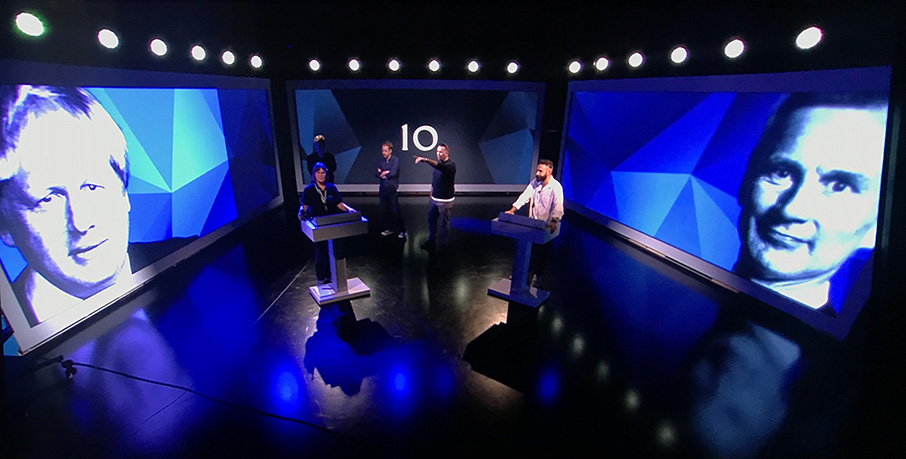
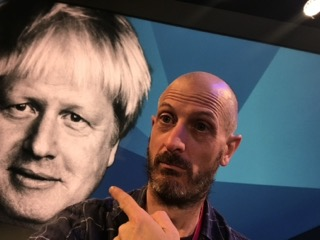

## The many...many...live Election Debates

Attempts to give the UK a version of the head-to-head "US Presidential style" Debates had, for decades, been repeatedly rebuffed by whoever was in power at the time (as they had the most to loose), but in 2010, with no clear result ahead, all the parties gave-in and agreed to a very low-key version for the 2010 General Election. Richard wasn't involved in this, as had only just started Freelancing for Sky at that point; however this is mentioned because both that Debate - and Election that followed - had a result that can best be described as a **No-Score Draw** for all the teams involved...

So, roll on the then-legally-fixed nice and predictable 5 year delay until the next one. And then... nobody could then have predicted the utter carnage the next five years would result in. , even those encouraging the chaos from 1500 miles to the east (...!) 




The videos shown below are of their time and have highly polarising political content - LightingDir.Com neither endorses or opposes any of the views expressed; however we do recommend use of your  _Mute_ 🔇 button should your blood pressure rise at any point.





## The Battle for Number 10

### Cameron vs Millband (Studio 4/5)



Conservative Central Office very much wanted to control the narrative, and didn't like the danger of people asking unpredictable questions, so they stonewalled all attempts for even a repeat of 2010's very flat Debate, to the point that all the broadcasters gave up on the idea. Then, in a last minute in attempt to be clever, they suddenly said _Yes - but we can only do it next week_ - knowing full well that it takes weeks to put a production team together, find and book a suitable location, design & build a set, install all the technical equipment and support infrastructure, and months to design graphics, find an evenly-balanced audience to ask questions, and so on...let alone arranging all the security needed for such a high-profile event. Well, if there's one thing News Broadcasters do differently to their colleagues elsewhere, its speed... and a massive rabbit got pulled-out of the hat in just 5 days...

The call is made to John Ryley, Head of Sky News, and a date of just 5 days time is fixed. He then tells Head of Studios Jon Bennett to somehow make this happen somewhere, somehow. Jon realises that all the prestigious locations that had been planned-for over the previous 5 years just couldn't be secured in time, and the only place that might work in the timescale would be the big general-purpose studio across the road...however he'd never worked in it and didn't really know what worked in that space, and hadn't got time to go through the usual polite meetings with management and so on.

Counting back from the moment of transmission (TX), allowing for presenter rehearsals on the day, technical rehearsals the day beforehand, ideally two days. Then add the build of the Set (even if it's basically video walls) will take at least two days to build, with lights/sound/cameras going in and around, which makes 4 days - and they had 5, and no plan, no crew, and no studio at this stage. Oops. But this is News, they achieve the impossible everyday. Now, Who could give him all the answers to the studio, and who needs to get in to the studio first...

Jon (somehow) finds-out that Richard was working on _Ringside_ (Sky Sports Boxing magazine show) in the next building, and, highly-unusually, leaves News and has a very quiet and quick discussion in the corridor with Richard. Five minutes later - with Ringside unceremoniously offloaded onto his team with no explanation to anyone beyond "Very Sorry, I have to go. Right now. Will explain later." - the pair of them are in a taxi heading as fast as possible across town to meet with Production designers Jago. A short meeting later, with invaluable advise from Richard about what facilities the studio has (such as seating, cameras, power, rigging, etc) and how its been successfully used (or not) previously, they are heading back to Osterley on a train, which gives Richard the opportunity to sketch something out on the back of an envelope. Phone calls are made, an outline of the logistics involved is determined, many conversations are started with the cryptic phrase "Umm...do you know what I know...?", and that afternoon the schedule for pretty much everyone in the lighting department for the next week was upended without any explanation, as there was extensive knock-on effects with sports productions being relocated - but that's what lighting people are used to - and they all pulled-together magnificently.

After all that, and the hurried nature of these designs, the production and lighting design turned-out to be so successful that it they went on to be repeated in an essentially similar form multiple times over the very turbulent (...!) period of politics that followed, as the rest of this section shows :



A simple set - three video walls with a little bit of decorative LED, plus quite a nice desk. As much as could be order & built in 4 days!
Richard added a black box truss above each screen with a row of precisely-spaced Martin Mac Auras as visual eye-candy for any vertical shoot off - and also to hide the camera used to shoot backwards at the audience. _(which was perched up on top of a wobbly Highlift with a 500:1 lens)_

A U-shaped arc of Sharpie Washes lit the grey bits of flooring, and VL-1000's were used as Keylights for flexibility and limited space.


It quickly became a running joke that this first lighting plot got used so many times it should have been laminated. 

Although different studios and different budgets meant this was not _always_ true... it **was** for _three_ occasions in _four_ years.  
Not bad for something only supposed to happen once every 4-5 years ...!









## The Battle for the Labour Leadership

### Corbyn vs Smith (Studio 4/5)

Technically the only one of these not featuring a sitting or about-to-be prime minister, but very much the same production format. This was also unique for being the only iteration where the candidates actually went head-to-head against each other (terribly politely of course), instead of the Tories consistent avoidance of any direct comparison. 

Lighting-wise very stripped-back, as there was no budget to hire-in moving lights, but the look was still kept very clean and allowed for free movement across the studio floor for Q&A's.






## IN or OUT?

### Cameron vs Gove (The Hub)

_(OB in atrium of adjacent office building)_

A very challenging venue of a very awkwardly-shaped atrium where nothing was symmetrical. Daylight falling on the area and two live shows each going out around sunset. Rigging points were nearly non-existent, and there was a coffee shop on one side, pedestrian gates in the middle, open-plan offices on 3 levels in use throughout. Plus absolutely no infrastructure and everything had to be done as a full OB despite being in centre of the Sky Campus surrounded by studio buildings. And, due to prior commitments, no staff electricians available and would have to use external crew.

A Great, very natural, look was achieved with very mixed rig of tungsten and led lighting, carefully balanced with the natural daylight as the sun set, across two days of live broadcasts. Would have put this in for KOI (see below), right up until...



Unfortunately this when Gove made the infamous “I think we've all had enough of experts” quote... 🤦‍♂️










## The Battle for Number 10 (2017)

### May vs Corbyn (Studio 4/5)

Back in Studio 4/5 for this, and almost a complete re-run of 2 years earlier from a lighting point of view.

The results were very crisp and clean, thanks to a great time all working together, and the show itself went very smoothly.  







## The Battle for Number 10 (2019)

### Johnson vs Corbyn (Studio 4/5)

Built, rehearsed, then cancelled due to Boris refusing to come

Still, everyone got to rehearse the show again, just in case they had missed the previous four in as many years...

Richard felt he was being chased by a giant Boris - like the killer beachball in The Prisoner...  





## The Battle for the Conservative Leadership

### Sunack vs Truss (Studio F)

Turned-out they they both "won" in quick succession - although Sunack lasted in the job far longer than Truss did...




## Knights of Illumination Awards 2017

A totally unexpected upshot of these debates, was that in 2017 Richard was amazed at being honoured by receiving a Nomination in the annual _Knight of Illumination Award_  for the **Best Small Studio** category. This peer-nominated and judged award - now superseded by the [Profile Awards](https://profileawards.com/television-categories/) - was the lighting version of being nominated for a Brit.  Yes, Studio 4/5 may be the biggest TV studio Sky has, but its still a small studio compared to the ones used for the likes of Strictly / X-Factor / etc, let alone their own Film stages. Its also a very unhelpful sausage shape, but that's another story entirely._ 



## Navigation

-  
-  
 


-  

